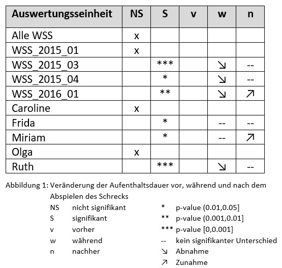

```{r, include=FALSE}

knitr::opts_chunk$set(warning = FALSE, message = FALSE, collapse = TRUE)

library(ComputationalMovementAnalysisData)
library(tidyverse)
library(lubridate)
library(ggplot2)
library(udunits2)
library(sf)
library(rosm)
library(ggspatial)
library(patchwork)

```

## Einleitung

Der Wildschweinbestand in der Schweiz wächst seit Jahrzehnten stetig an. Die Tiere verursachen dabei insbesondere in landwirtschaftlich genutzten Flächen Schäden in Millionenhöhe. Um die Wildschweine von den Feldern fernzuhalten, wurden im Rahmen einer Studie der ZHAW-Forschungsgruppe Wildtiermanagement verschiedene Präventionsmethoden getestet und auf ihre Wirksamkeit verglichen. (ZHAW Medienmitteilung 2019)

Neben konventioneller Prävention mittels Elektrozäunen und Vergrämungsabschüssen, wurde auch der neu entwickelte Wildschweinschreck geprüft. Ein System aus batteriebetriebenen Lautsprechern, welche aufgezeichnete Warnrufe von Wildschweinen sowie andere, nicht arteigene Geräusche (z.B. Gewehrschüsse, menschliche Stimmen, Hundegebell), welche die Tiere mit Gefahr in Verbindung bringen, wiedergeben. Mittels dieser akustischen Signale soll das Schwarzwild aus den Landwirtschaftsflächen vertrieben und die durch sie verursachten Schäden vermindert werden.(Suter et al. 2018)

Während des in den Jahren 2014 bis 2017 vorgenommenen Feldversuchs wurden in drei, gezielt ausgewählten, Schweizer Regionen rund 150 Wildschweine gefangen und markiert. Neben der Schadensdokumentation der Felder selbst, wurde zusätzlich das Raumverhalten von 36 mit GPS-Halsbändern ausgestatteten Tieren analysiert. Der in der ZHAW-Studie durchgeführte Vergleich hat ergeben, dass keine der untersuchten Methoden absoluten Schutz vor Feldschäden bietet, generell seien auf präventiv geschützten Feldern die Schäden jedoch kleiner als auf gänzlich ungeschützten landwirtschaftlichen Flächen. (ZHAW Medienmitteilung 2019)

Im Rahmen des Moduls wurden ausgewählte Daten des genannten Forschungsprojekts zur Verfügung gestellt. Hierzu gehören die GPS-Positionen der Wildschweine im Untersuchungsgebiet Fanel (Bern) sowie die Standorte und Laufzeiten der Wildschweinschrecke. Das Fanel liegt am nord-östlichen Ende des Neuenburger Sees und gehört zum Inventar der Wasser- und Zugvogelreservate von nationaler und internationaler Bedeutung. Als eines der grössten zusammenhängenden Feuchtgebiete der Schweiz bieten der vorgelagerte Uferwald und das Ried den Wildschweinen einen ausgezeichneten Lebensraum. Die Landwirtschaft in der Umgebung profitiert von guten Böden und einem milden Klima. Es werden wertvolle Kulturen angebaut, weshalb der Druck durch Schwarzwild sehr hoch ist. (Suter et al. 2018)

Mit den gegebenen Daten soll nachfolgend explorativ und statistisch versucht werden, einen Effekt der akustischen Vergrämungsmethode nachzuweisen. Hierfür werden die Daten auf sich zeitlich überschneidende Wildschweine und Wildschweinschrecke gefiltert. Anschliessend wird die Anzahl von Individuen innerhalb eines definierten Radius um einen Wildschweinschreck sowie ihre Aufenthaltsdauer darin ermittelt. Diese wird schliesslich auf Signifikanz untersucht und die Resultate diskutiert.

## Material und Methoden

### Daten

Für die folgenden Analysen wurde mit Daten gearbeitet, welche von der Kursleitung unter [CMA Github](https://computationalmovementanalysis.github.io/ComputationalMovementAnalysisData/index.html) zur Verfügung gestellt wurden.

Im **Wildschwein**-Datensatz befinden sich die Positionen von 19 verschiedenen Individuen, aufgenommen im Zeitraum Mai 2014 bis Oktober 2016 im Studiengebiet Bern. Für jeden Fixpunkt der rund 300'000 Beobachtungen wurden der Names des Tieres, seine Koordinaten, sowie der Zeitstempel verwendet, übrige Attribute wurden entfernt.

```{r, cols.print=4, rows.print=3}

wildschwein  <- wildschwein_BE

# Wähle nur relevante Spalten
wildschwein <- subset(wildschwein, select = c("TierName", "DatetimeUTC", "E", "N"))

# Überschreiben als sf-Objekt
wildschwein <- st_as_sf(wildschwein, 
                  coords = c("E", "N"), 
                  crs = 2056,
                  remove = FALSE)

wildschwein #Tabelle für html-Export

```

```{r, echo=FALSE, fig.align='center', fig.height=6, fig.width=6}

ggplot() +
  annotation_map_tile("osm", zoom = 15, alpha = 0.5, progress = "none") +
  geom_sf(wildschwein, mapping = aes(color = TierName, alpha = 0.8)) +
  coord_sf(datum = 2056) +
  labs(title = "Positionen der Wildschweine") +
  theme(legend.position = "none",
        title = element_text(size=10))

```

Für die **Wildschweinschrecke** (WSS) stehen zwei Datensätze bereit, je einer zu den Standorten sowie den Daten zur Laufzeit, nebst einiger Metadaten. Beide Datensätze wurden zu Beginn der Arbeit vereint und um die nicht benötigten Attribute reduziert. Die für die Analyse genutzten sind vor allem die *ID*, *Koordinaten* sowie das *Datum*, an dem der WSS an- und ausgeschaltet wurde.

```{r, cols.print=4, rows.print=3}

schreck_locations <- schreck_locations
schreck_agenda <- schreck_agenda

# Verbinde Datensätze Schreck Locations und Agenda
schreck <- left_join(schreck_locations, schreck_agenda, by = "id")

# Wähle nur relevante Spalten
schreck <- subset(schreck, select = c("id", "region", "lat", "lon", "datum_on", "datum_off"))

# Filter auf Untersuchungsgebiet
schreck <- subset(schreck, region == "fanel")

# Überschreiben als sf-Objekt
schreck <- st_as_sf(schreck,
                    coords = c("lon", "lat"),
                    crs = 4326,
                    remove = FALSE)

schreck <- st_transform(schreck, 2056)

schreck #Tabelle für html-Output

```

```{r, echo=FALSE, fig.align='center', fig.height=6, fig.width=6}

ggplot() +
  annotation_map_tile("osm", zoom = 14, alpha = 0.5, progress = "none") +
  geom_sf(schreck, mapping = aes(color = id, size = 3, alpha = 0.8)) +
  coord_sf(datum = 2056) +
  theme(legend.position = "none") +
  labs(title = "Positionen der Wildschweinschrecke") +
  theme(legend.position = "none",
        title = element_text(size=10))

```

### Vorprozessierung

Ein erster räumlicher Überblick zeigte, dass alle WSS des Forschungsprojekts im Datensatz vorhanden waren, auch jene, die nicht zum Untersuchungsgebiet gehörten. Dieser wurde daher auf die für diese Arbeit relevante die Fanel-Region, reduziert.

Zudem galt es herauszufinden, wann eine zeitliche Überschneidung der Laufzeiten der WSS mit den Aufnahmezeiten der Wildschweine stattfand. Jene WSS aus dem Jahr 2017 konnten gänzlich ausgeschlossen werden. Da für die weitere Analyse das Verhalten der Tiere auch vor und nach eigentlicher WSS-Laufzeit interessant war, lag unser Fokus auf jenen, die eine genügend lange Überschneidung zeigten. Es entfielen somit weitere WSS aus den Jahren 2014 und 2016 sowie einzelne Wildschweine.

```{r, fig.keep='last', fig.align='center', fig.height=6, fig.width=6}

# Laufzeiten Wildschreck
schreck_duration <- schreck %>%
  group_by(id) %>%
  summarise(min = min(datum_on), max = max(datum_off))


# Laufzeiten Wildschweine

# neue Spalte mit Datum
wildschwein <- wildschwein %>%
  mutate(Datum = as.Date(DatetimeUTC))

wildschwein_duration <- wildschwein %>%
  group_by(TierName) %>%
  summarise(min = min(DatetimeUTC), max = max(DatetimeUTC))


# Überlagern Laufzeiten Wildschweine und Schrecke erste Übersicht
ggplot()+
  geom_errorbarh(wildschwein_duration, mapping = aes(xmin = min, xmax = max, y = TierName))+
  geom_errorbarh(schreck_duration, mapping = aes(xmin = min, xmax = max, y = id))

# Entferne irrelevante Schrecke und Tiere
schreck <- subset(schreck, id!="WSS_2017_09" & id!="WSS_2017_07" & id!="WSS_2017_04" & id!="WSS_2017_03" & id!="WSS_2017_02" & id!="WSS_2017_01" & id!="WSS_2016_13" & id!="WSS_2014_04" & id!="WSS_2014_05" & id!="WSS_2014_06")

wildschwein <- subset(wildschwein, TierName!="Amos" & TierName!="Claude" & TierName!="Evelin" & TierName!="Fritz" & TierName!="Isabelle")


# Selbe Filter nochmal auf den kleineren Datensatz anwenden
schreck_duration <- subset(schreck_duration, id!="WSS_2017_09" & id!="WSS_2017_07" & id!="WSS_2017_04" & id!="WSS_2017_03" & id!="WSS_2017_02" & id!="WSS_2017_01" & id!="WSS_2016_13" & id!="WSS_2014_04" & id!="WSS_2014_05" & id!="WSS_2014_06")

wildschwein_duration <- subset(wildschwein_duration, TierName!="Amos" & TierName!="Claude" & TierName!="Evelin" & TierName!="Fritz" & TierName!="Isabelle")


# Überlagern Laufzeiten Wildschweine und Schrecke
ggplot()+
  geom_errorbarh(wildschwein_duration, mapping = aes(xmin = min, xmax = max, y = TierName))+
  geom_errorbarh(schreck_duration, mapping = aes(xmin = min, xmax = max, y = id))+
  labs(title = "Lauf- und Aufnahmezeiten", y = "") +
  theme(legend.position = "none",
        title = element_text(size=10))

```


Bei den übrigen Wildschweinen erfolgte schliesslich eine Zuweisung der aufgezeichneten WSS-Datenzeitpunkte in Perioden *vorher*, *während* und *nachher*. Hierbei wurde die effektive Laufzeit der WSS in Tagen oder Wochen und die gleiche Zeitdauer vor und nach dessen Laufzeit herausgefiltert. Dieses Vorgehen diente dazu, die Reaktion bzw. das Verhaltensmuster der Wildschweine vor, während und nach der Laufzeit der WSS miteinander zu vergleichen.

```{r}

# Rechnerische Überschneidung Laufzeiten Schreck und Wildschwein

# Anlegen Funktion, die mit Vektoren (hier unsere Zeitstempel) klarkommt
compare_time <- function(timecolumn, starttime, endtime){
  ifelse(timecolumn < starttime, "vorher", 
    ifelse(timecolumn < endtime, "während", "nachher"))
  }


# Zuweisung der Perioden zu einzelnen Schrecks

# WSS_2015_01
# Laufzeit 20.05.-01.07. (Achtung: Unterschiedliche Modi in Gesamt-Laufzeit nicht! unterschieden)

filter_WSS_2015_001 <- subset(schreck, id == "WSS_2015_01") 

filter_WSS_2015_001$datum_on - filter_WSS_2015_001$datum_off # 23 Tage | 19 Tage | Total 42 Tage Laufzeit

filter_WSS_2015_001$datum_on - ddays(42) # 2015-04-08

filter_WSS_2015_001$datum_off + ddays(42) # 2015-08-12

rm(filter_WSS_2015_001)

# Zeitdauer filtern und Zuweisung der Perioden
WSS_2015_01_besendert <- wildschwein %>%
 filter(Datum > "2015-04-08" & Datum < "2015-08-12") %>%
  mutate(Period = compare_time(Datum, "2015-05-20", "2015-07-01"))


# WSS_2015_03
# Laufzeit 22.05.-01.07. (Achtung: Unterschiedliche Modi in Gesamt-Laufzeit nicht! unterschieden)

filter_WSS_2015_03 <- subset(schreck, id == "WSS_2015_03") 

filter_WSS_2015_03$datum_on - filter_WSS_2015_03$datum_off # 21 Tage | 19 Tage | Total 40 Tage Laufzeit

filter_WSS_2015_03$datum_on - ddays(40) # 2015-04-12

filter_WSS_2015_03$datum_off + ddays(40) # 2015-08-10

rm(filter_WSS_2015_03)

# Zeitdauer filtern und Zuweisung der Perioden
WSS_2015_03_besendert <- wildschwein %>%
 filter(Datum > "2015-04-12" & Datum < "2015-08-10") %>%
  mutate(Period = compare_time(Datum, "2015-05-22", "2015-07-01"))


# WSS_2015_04
# Laufzeit 27.05.-01.07. (Achtung: Unterschiedliche Modi in Gesamt-Laufzeit nicht! unterschieden)

filter_WSS_2015_04 <- subset(schreck, id == "WSS_2015_04")

filter_WSS_2015_04$datum_on - filter_WSS_2015_04$datum_off # 16 Tage | 19 Tage | Total 35 Tage Laufzeit

filter_WSS_2015_04$datum_on - ddays(35) # 2015-04-22

filter_WSS_2015_04$datum_off + ddays(35) # 2015-08-05

rm(filter_WSS_2015_04)

# Zeitdauer filtern und Zuweisung der Perioden
WSS_2015_04_besendert <- wildschwein %>%
 filter(Datum > "2015-04-22" & Datum < "2015-08-05") %>%
  mutate(Period = compare_time(Datum, "2015-05-27", "2015-07-01"))


# WSS_2016_01
# Laufzeit 04.04.-23.04.

filter_WSS_2016_01 <- subset(schreck, id == "WSS_2016_01") 

filter_WSS_2016_01$datum_on - filter_WSS_2016_01$datum_off # Total 19 Tage Laufzeit

filter_WSS_2016_01$datum_on - ddays(19) # 2016-03-16

filter_WSS_2016_01$datum_off + ddays(19) # 2016-05-12

rm(filter_WSS_2016_01)

# Zeitdauer filtern und Zuweisung der Perioden
WSS_2016_01_besendert <- wildschwein %>%
 filter(Datum > "2016-03-16" & Datum < "2016-05-12") %>%
  mutate(Period = compare_time(Datum, "2016-04-04", "2016-04-23"))


# WSS_2016_05
# Laufzeit 15.06.-15.07.

filter_WSS_2016_05 <- subset(schreck, id == "WSS_2016_05")

filter_WSS_2016_05$datum_on - filter_WSS_2016_05$datum_off # Total 30 Tage Laufzeit

filter_WSS_2016_05$datum_on - ddays(30) # 2016-05-16

filter_WSS_2016_05$datum_off + ddays(30) # 2016-08-14

rm(filter_WSS_2016_05)

# Zeitdauer filtern und Zuweisung der Perioden
WSS_2016_05_besendert <- wildschwein %>%
 filter(Datum > "2016-05-16" & Datum < "2016-08-14") %>%
  mutate(Period = compare_time(Datum, "2016-06-15", "2016-07-15"))


# WSS_2016_06
# Laufzeit 15.06.-15.07.

filter_WSS_2016_06 <- subset(schreck, id == "WSS_2016_06") 

filter_WSS_2016_06$datum_on - filter_WSS_2016_06$datum_off # Total 30 Tage Laufzeit

filter_WSS_2016_06$datum_on - ddays(30) # 2016-05-16

filter_WSS_2016_06$datum_off + ddays(30) # 2016-08-14

rm(filter_WSS_2016_06)

# Zeitdauer filtern und Zuweisung der Perioden
WSS_2016_06_besendert <- wildschwein %>%
 filter(Datum > "2016-05-16" & Datum < "2016-08-14") %>%
  mutate(Period = compare_time(Datum, "2016-06-15", "2016-07-15"))

```

Im Rahmen der explorativen Datenanalyse haben wir ausserdem diverse Bewegungsparameter, z.B. Homerange der Wildschweine, ihre Geschwindigkeit sowie Trajektorien anschaut.

Schwarzwild verbringt einen Grossteil des Tages ruhend. Sind sie gezwungen zu flüchten, erreichen sie zwar durchaus Geschwindigkeiten von etwa 40 km/h, allerdings halten sie dies nicht lange aufrecht und fallen nach kurzer Zeit in einen Trab mit 6 bis maximal 10km/h zurück. (Morelle et al. 2015) Das Aufnahmeintervall von 15 Minuten deckt diese kurze Fluchtreaktion somit ungenügend ab und ein etwaiger Effekt lässt sich in den Daten nicht ablesen. Der Ansatz wurde daher nicht weiterverfolgt.

```{r, fig.keep='none'}

# Berechne zeitliche Verzögerung zwischen Aufnahmen
wildschwein <- wildschwein %>%
  group_by(TierName) %>%
  mutate(timelag = as.numeric(difftime(lead(DatetimeUTC),DatetimeUTC,units = "secs")))

# Berechne euklidische Distanz über alle
wildschwein <- wildschwein %>%
  group_by(TierName) %>%
  mutate(steplength = sqrt((E-lead(E))^2+(N-lead(N))^2))

# Berechne Geschwindigkeit
wildschwein <- wildschwein %>%
  group_by(TierName) %>%
  mutate(speed = steplength/timelag)


# Berechne Homerange

# Gruppiere je Tier
wildschwein_group <- group_by(wildschwein, TierName)

# Forme aus einzelnen Tier-Punkten ein Multi-Point-Feature pro Tier
wildschwein_multipoint <-  summarise(wildschwein_group)

# Rechne Convex Hull pro Tier
wildschwein_homerange <- st_convex_hull(wildschwein_multipoint)

rm(wildschwein_group)
rm(wildschwein_multipoint)


# Trajektorien

# Segmentation
# Sampling Intervall 15 Minuten --> Zeitfenster 60 Minuten
wildschwein_traj <- wildschwein %>%
  mutate(
    nMinus2 = sqrt((lag(E,2)-E)^2+(lag(N,2)-N)^2),   # distance to pos -30 minutes
    nMinus1 = sqrt((lag(E,1)-E)^2+(lag(N,1)-N)^2),   # distance to pos -15 minutes
    nPlus1  = sqrt((E-lead(E,1))^2+(N-lead(N,1))^2), # distance to pos +15 mintues
    nPlus2  = sqrt((E-lead(E,2))^2+(N-lead(N,2))^2)  # distance to pos +30 minutes
  )

# Berechne stepMean für jeden Punkt in Zeitfenster
wildschwein_traj <- wildschwein_traj %>%
  group_by(TierName) %>%
  rowwise() %>%
  mutate(stepMean = mean(c(nMinus2, nMinus1, nPlus1, nPlus2))) %>%
  ungroup()

# Betrachte stepMean um Threshold zu finden
summary(wildschwein_traj$stepMean) #Mean 50.576

ggplot(wildschwein_traj, aes(x=stepMean)) +         
  geom_histogram() +
  scale_x_continuous(limits = c(0,1000)) +
  scale_y_continuous(limits = c(0,9000))

# Entferne statische Werte
wildschwein_traj <- wildschwein_traj %>%
  mutate(static = stepMean < mean(stepMean, na.rm = TRUE))

ggplot(wildschwein_traj, aes(E, N, color = static)) +
  geom_path() +
  geom_point() +
  coord_sf(datum = 2056)

# Weise Segment ID zu um diese zur Gruppierung zu nutzen
rle_id <- function(vec){
  x <- rle(vec)$lengths
  as.factor(rep(seq_along(x), times = x))
}

wildschwein_traj <- wildschwein_traj %>%
  mutate(segment_id = rle_id(static))

# Visualisiere Segmente, die sich bewegen mittels Segment ID
wildschwein_traj_filter <- wildschwein_traj %>%
  filter(static == FALSE)
  
ggplot(wildschwein_traj_filter, aes(E, N, color = TierName)) +
  geom_path() +
  geom_point() +
  coord_sf(datum = 2056) +
  labs(title = "Alle Bewegungs-Segmente ungefiltert")

# Nutze segment_ID um Dauer zu bestimmen und zu kurze Segmente zu entfernen
wildschwein_traj_move <- wildschwein_traj_filter %>%
  group_by(TierName, segment_id) %>%
  mutate(duration = max(DatetimeUTC)-min(DatetimeUTC)) %>% #berechne Dauer der Bewegung
  filter(duration > 21600) #entferne alle Segmente mit Bewegung < 6 Stunden

```

```{r, echo=FALSE, fig.align='center', fig.height=6, fig.width=6}

ggplot() +
  annotation_map_tile("osm", zoom = 14, alpha = 0.5, progress = "none") +
  geom_sf(wildschwein_homerange, mapping = aes(color = TierName, alpha = 0.8)) +
  coord_sf(datum = 2056) +
  theme(legend.position = "bottom",
        title = element_text(size = 10)) +
  labs(title = "Homeranges der Wildschweine", color = "") +
  guides(alpha = "none")

```

```{r, echo=FALSE, fig.align='center', fig.height=6, fig.width=6}

# Trajektorien
ggplot(wildschwein_traj_move, mapping = aes(E, N, color = TierName)) +
  geom_path() +
  geom_point() +
  coord_sf(datum = 2056) +
  labs(title = "Trajektorien der Wildschweine (Seg.dauer > 6h)", x = "", y = "") +
  theme(legend.position="none",
        title = element_text(size = 10),
        axis.text.x=element_blank(),
        axis.ticks.x=element_blank(),
        axis.text.y=element_blank(),
        axis.ticks.y=element_blank() 
        ) +
  facet_wrap(~TierName)

```

### Räumliche Analyse

Beim Einsatz von akustischen Geräten wie dem Wildschweinschreck ist darauf zu achten, dass mit zunehmender Distanz die Lautstärke abnimmt. Dies kann den Vergrämungseffekt beeinflussen. Die maximale Lautstärke des WSS beträgt 120 dB in einem Meter Entfernung. Mit der maximalen Lautstärke beträgt die Reichweite mind. 1000m. (WLS.ch 2022)

In der Schreck-Agenda wird die Lautstärke je WSS in Prozent des maximalen Wertes angegeben, wobei die niedrigste Lautstärke 25 % von 120dB beträgt. Wenn wir von einer Linearen Abnahme der Lautstärke auf zunehmende Distanz ausgehen, beträgt die Reichweite mit 30dB noch 250m. Um einen Effekt über alle Lautstärken nachweisen zu können, haben wir uns für einen Radius von 200m um den WSS entschieden. Es wird somit davon ausgegangen, dass der WSS auf eine Distanz von 200m von den Wildschweinen für alle Lautstärken noch gut hörbar ist und Individuen, die sich innerhalb dieses Radius befinden, eine Reaktion zeigen.

Die WSS_2016_06 und WSS_2015_04 liegen sehr dicht beieinander, ihre Radien überschneiden sich. Da sie jedoch zu unterschiedlichen Zeiten liefen, braucht es in der weiteren Analyse nicht berücksichtigt werden.

Anschliessend haben wir ermittelt, welche Wildschweine sich vor, während und nach der Laufzeit innerhalb des gewählten Radius aufgehalten haben. Danach wurde anhand des Zeitstempels ermittelt, welche Positionspunkte in welche Periode fallen und diese entsprechend zugeordnet.

```{r, fig.align='center', fig.height=6, fig.width=6}

# Füge alle besenderten Wildschwein zu Schrecklaufzeiten zusammen
WSS_all_besendert <- bind_rows(WSS_2015_01_besendert, WSS_2015_03_besendert, WSS_2015_04_besendert, WSS_2016_01_besendert, WSS_2016_05_besendert, WSS_2016_06_besendert)


# Buffer von 200m um einzelne Schrecke
schreck_200buffer <- st_buffer(schreck, 200)


# Buffer um Schreck WSS_2015_01
WSS_2015_01_buffer <- schreck_200buffer %>%
  filter(id == "WSS_2015_01")

# Verschneide zuvor gewählte Wildschweine in Schreck-Laufzeit mit Buffer
WSS_2015_01_besendert_buffer <- st_intersection(WSS_all_besendert, WSS_2015_01_buffer)


# Buffer um Schreck WSS_2015_03
WSS_2015_03_buffer <- schreck_200buffer %>%
  filter(id == "WSS_2015_03")

# Verschneide zuvor gewählte Wildschweine in Schreck-Laufzeit mit Buffer
WSS_2015_03_besendert_buffer <- st_intersection(WSS_all_besendert, WSS_2015_03_buffer)


# Buffer um Schreck WSS_2015_04
WSS_2015_04_buffer <- schreck_200buffer %>%
  filter(id == "WSS_2015_04")

# Verschneide zuvor gewählte Wildschweine in Schreck-Laufzeit mit Buffer
WSS_2015_04_besendert_buffer <- st_intersection(WSS_all_besendert, WSS_2015_04_buffer)


# Buffer um Schreck WSS_2016_01
WSS_2016_01_buffer <- schreck_200buffer %>%
  filter(id == "WSS_2016_01")

# Verschneide zuvor gewählte Wildschweine in Schreck-Laufzeit mit Buffer
WSS_2016_01_besendert_buffer <- st_intersection(WSS_all_besendert, WSS_2016_01_buffer)


# Buffer um Schreck WSS_2016_05
WSS_2016_05_buffer <- schreck_200buffer %>%
  filter(id == "WSS_2016_05")

# Verschneide zuvor gewählte Wildschweine in Schreck-Laufzeit mit Buffer
WSS_2016_05_besendert_buffer <- st_intersection(WSS_all_besendert, WSS_2016_05_buffer)


# Buffer um Schreck WSS_2016_06
WSS_2016_06_buffer <- schreck_200buffer %>%
  filter(id == "WSS_2016_06")

# Verschneide zuvor gewählte Wildschweine in Schreck-Laufzeit mit Buffer
WSS_2016_06_besendert_buffer <- st_intersection(WSS_all_besendert, WSS_2016_06_buffer)


ggplot() +
  annotation_map_tile("osm", zoom = 13, alpha = 0.5, progress = "none") +
  geom_sf(schreck_200buffer, mapping = aes(color = id)) +
  geom_sf(schreck, mapping = aes(color = id, size = 3, alpha = 0.8)) +
  coord_sf(datum = 2056) +
  theme(legend.position = "bottom",
        title = element_text(size = 10)) +
  labs(title = "Ausgewählte Wildschweinschrecke mit Radius 200m", color = "") +
  guides(alpha = "none", size = "none")


```

Ergänzend entschieden wir uns die effektive Aufenthaltsdauer der Tiere innerhalb des Radius zu berechnen. Nachdem wir dies zunächst auf Tage summiert haben, entschieden wir uns zugunsten feinerer Granularität auf Stunden. Dies lässt eine bessere Vergleichbarkeit zu wenn die Wildschweine sich nur wenige Minuten am Tag innerhalb des Radius aufhielten.

```{r}

# Anlegen Funktion um einzelne Zeitspannen zu segmentieren
rle_id <- function(vec){
  x <- rle(vec)$lengths
  as.factor(rep(seq_along(x), times = x))
}

# Exemplarisch Aufenthaltsdauer in Tagen
wildschwein_WSS_2015_01_duration_days <- 
  WSS_2015_01_besendert_buffer %>%
  st_drop_geometry() %>%
  group_by(TierName, Period) %>%
  summarise(geht_rein = min(DatetimeUTC), geht_raus = max(DatetimeUTC)) %>%
  mutate(dauer = as.integer(difftime(geht_raus, geht_rein, units = "days")))

rm(wildschwein_WSS_2015_01_duration_days)


# Aufenthaltsdauer in Stunden (gerundet)

# Neue Spalte mit Eigenschaft ob im Buffer oder ausserhalb
WSS_2015_01_besendert <- WSS_all_besendert %>%
  mutate(im_buff = st_intersects(WSS_all_besendert, WSS_2015_01_buffer, sparse = FALSE)[,1])

wildschwein_WSS_2015_01_duration <-
  WSS_2015_01_besendert %>%
  st_drop_geometry() %>%
  group_by(TierName) %>%
  mutate(segment = rle_id(im_buff)) %>%
  filter(im_buff=TRUE) %>%
  group_by(TierName, segment, Period) %>%
  summarise(geht_rein = min(DatetimeUTC), geht_raus = max(DatetimeUTC)) %>%
  mutate(dauer = as.numeric(difftime(geht_raus, geht_rein, units = "hours")))


WSS_2015_03_besendert <- WSS_all_besendert %>%
  mutate(im_buff = st_intersects(WSS_all_besendert, WSS_2015_03_buffer, sparse = FALSE)[,1])

wildschwein_WSS_2015_03_duration <-
  WSS_2015_03_besendert %>%
  st_drop_geometry() %>%
  group_by(TierName) %>%
  mutate(segment = rle_id(im_buff)) %>%
  filter(im_buff=TRUE) %>%
  group_by(TierName, segment, Period) %>%
  summarise(geht_rein = min(DatetimeUTC), geht_raus = max(DatetimeUTC)) %>%
  mutate(dauer = as.numeric(difftime(geht_raus, geht_rein, units = "hours")))


WSS_2015_04_besendert <- WSS_all_besendert %>%
  mutate(im_buff = st_intersects(WSS_all_besendert, WSS_2015_04_buffer, sparse = FALSE)[,1])

wildschwein_WSS_2015_04_duration <-
  WSS_2015_04_besendert %>%
  st_drop_geometry() %>%
  group_by(TierName) %>%
  mutate(segment = rle_id(im_buff)) %>%
  filter(im_buff=TRUE) %>%
  group_by(TierName, segment, Period) %>%
  summarise(geht_rein = min(DatetimeUTC), geht_raus = max(DatetimeUTC)) %>%
  mutate(dauer = as.numeric(difftime(geht_raus, geht_rein, units = "hours")))


WSS_2016_01_besendert <- WSS_all_besendert %>%
  mutate(im_buff = st_intersects(WSS_all_besendert, WSS_2016_01_buffer, sparse = FALSE)[,1])

wildschwein_WSS_2016_01_duration <-
  WSS_2016_01_besendert %>%
  st_drop_geometry() %>%
  group_by(TierName) %>%
  mutate(segment = rle_id(im_buff)) %>%
  filter(im_buff=TRUE) %>%
  group_by(TierName, segment, Period) %>%
  summarise(geht_rein = min(DatetimeUTC), geht_raus = max(DatetimeUTC)) %>%
  mutate(dauer = as.numeric(difftime(geht_raus, geht_rein, units = "hours")))


WSS_2016_05_besendert <- WSS_all_besendert %>%
  mutate(im_buff = st_intersects(WSS_all_besendert, WSS_2016_05_buffer, sparse = FALSE)[,1])

wildschwein_WSS_2016_05_duration <-
  WSS_2016_05_besendert %>%
  st_drop_geometry() %>%
  group_by(TierName) %>%
  mutate(segment = rle_id(im_buff)) %>%
  filter(im_buff=TRUE) %>%
  group_by(TierName, segment, Period) %>%
  summarise(geht_rein = min(DatetimeUTC), geht_raus = max(DatetimeUTC)) %>%
  mutate(dauer = as.numeric(difftime(geht_raus, geht_rein, units = "hours")))


WSS_2016_06_besendert <- WSS_all_besendert %>%
  mutate(im_buff = st_intersects(WSS_all_besendert, WSS_2016_06_buffer, sparse = FALSE)[,1])

wildschwein_WSS_2016_06_duration <-
  WSS_2016_06_besendert %>%
  st_drop_geometry() %>%
  group_by(TierName) %>%
  mutate(segment = rle_id(im_buff)) %>%
  filter(im_buff=TRUE) %>%
  group_by(TierName, segment, Period) %>%
  summarise(geht_rein = min(DatetimeUTC), geht_raus = max(DatetimeUTC)) %>%
  mutate(dauer = as.numeric(difftime(geht_raus, geht_rein, units = "hours")))


```

### Statistische Analyse

Die Aufenthaltsdauer der Wildschweine in den drei unterschiedlichen Laufzeit-Perioden (vorher, während, nachher) haben wir anschliessend mittels einer ANOVA auf Signifikanz überprüft.

Hierbei wurden zunächst die Voraussetzungen zur Durchführung einer ANOVA mittels explorativer Datenanalyse ermittelt (Normalverteilung, Varianzhomogenität) und falls notwendig eine Transformation der Daten vorgenommen.

Verglichen wurde die Aufenthaltsdauer aller Tiere bei den einzelnen WSS, anschliessend die Aufenthaltsdauer zwischen den unterschiedlichen Perioden über alle WSS und schliesslich die Aufenthaltsdauer pro Individuum über sämtliche WSS. Die Individuen Donar, Franz, Joanna, Rosa und Venus wurden dabei wegen zu kleiner Stichproben (n \< 15) nicht berücksichtigt.

```{r, fig.keep='none'}

### Voraussetzungen prüfen


# Explorative Datenanalyse für WSS_2015_01

# Null-Werte mit NA ersetzen, da das Resultat ansonsten stark verfälscht wird
wildschwein_WSS_2015_01_duration$dauer[wildschwein_WSS_2015_01_duration$dauer == 0] <- NA

# Perioden nach Rängen ordnen
wildschwein_WSS_2015_01_duration$Period <- factor(wildschwein_WSS_2015_01_duration$Period,ordered = T,levels = c("vorher","während","nachher"))

# Boxplot
ggplot(wildschwein_WSS_2015_01_duration, aes(x = Period, y= dauer)) +
  geom_boxplot(fill = "white", color = "black", size = 1) + 
  labs(x="Periode", y="Aufenthaltsdauer", title = "WSS_2015_01")

# Mit den Plots ist kaum eine Verteilung festzustellen, da die Daten scheinbar stark von Ausreissern geprägt sind. Die Verteilung scheint aber auf eine rechtsschiefe Verteilung hinzuweisen. Deshalb werden die Daten erstmal transformiert.

# Logarithmus-Transformation
# Boxplot
ggplot(wildschwein_WSS_2015_01_duration, aes(x = Period, y= dauer)) +
  geom_boxplot(fill = "white", color = "black", size = 1) +
  scale_y_log10() +
  labs(x="Periode", y="Aufenthaltsdauer (log10-Transformation)", title = "WSS_2015_01")

# Voraussetzungen erfüllt
# Achtung! Skala von y-Achse ist nun Logarythmiert - kann nicht direkt abgelesen werden!

# Varianzanalyse (ANOVA) für WSS_2015_01
# Test auf Unterschiede in den Mittelwerten der Aufenthaltsdauer in der Nähe von Schreck
# Einfaktorielle Varianzanalyse für drei Gruppen
# Abhängige Variable mit log10 transformiert

summary(aov(log10(wildschwein_WSS_2015_01_duration$dauer)~wildschwein_WSS_2015_01_duration$Period))

summary.lm(aov(log10(wildschwein_WSS_2015_01_duration$dauer)~wildschwein_WSS_2015_01_duration$Period))

# Es kann kein signifikanter Unterschied der Aufenthaltsdauer bei WSS_2015_01 vor, während und nach dem Abspielen der Wildschweinschrecks festgestellt werden (F = 2.765, p = 0.0642).
# Es wird kein Post-hoc-Test (Tukey) durchgeführt


# Explorative Datenanalyse für WSS_2015_03

# Null-Werte mit NA ersetzen
wildschwein_WSS_2015_03_duration$dauer[wildschwein_WSS_2015_03_duration$dauer == 0] <- NA

# Perioden nach Rängen ordnen
wildschwein_WSS_2015_03_duration$Period <- factor(wildschwein_WSS_2015_03_duration$Period,ordered = T,levels = c("vorher","während","nachher"))

ggplot(wildschwein_WSS_2015_03_duration, aes(x = Period, y= dauer)) +
  geom_boxplot(fill = "white", color = "black", size = 1) + 
  labs(x="Periode", y="Aufenthaltsdauer", title = "WSS_2015_03")

# ausgeprägte Verletzung der Varianzhomogenität (ein Boxplot ist viel grösser als die anderen beiden)
# schauen, was bei Transformation herauskommt

# Logarithmus-Transformation
# Boxplot
ggplot(wildschwein_WSS_2015_03_duration, aes(x = Period, y= dauer)) +
  geom_boxplot(fill = "white", color = "black", size = 1) +
  scale_y_log10() +
  labs(x="Periode", y="Aufenthaltsdauer (log10-Transformation)", title = "WSS_2015_03")

# Varianzhomogenität erfüllt (wichtiger als Normalverteilung)
# Normalverteilung noch nicht ganz gegeben

# Varianzanalyse (ANOVA) für WSS_2015_03
# Test auf Unterschiede in den Mittelwerten der Aufenthaltsdauer in der Nähe von Schreck
# Einfaktorielle Varianzanalyse für drei Gruppen
# Abhängige Variable mit log10 transformiert

summary(aov(log10(wildschwein_WSS_2015_03_duration$dauer)~wildschwein_WSS_2015_03_duration$Period))

summary.lm(aov(log10(wildschwein_WSS_2015_03_duration$dauer)~wildschwein_WSS_2015_03_duration$Period))

# Die Aufenthaltsdauer der Wildschweine bei WSS_2015_03 unterscheidet sich hoch signifikant in den verschiedenen Perioden (F = 11.28, p < 0.0001)

# Post-hoc-Test (Tukey)
TukeyHSD(aov(log10(wildschwein_WSS_2015_03_duration$dauer)~wildschwein_WSS_2015_03_duration$Period))

# Die Wildschweine hielten sich bei WSS_2015_03 bevor der Schreck abgespielt wurde signifikant länger in der Nähe des Schrecks auf als in der Zeit während und nachher (p < 0.0001). Zwischen den Perioden "während" und "nachher" kann hingegen kein Unterschied festgestellt werden.


# Explorative Datenanalyse für WSS_2015_04

# Null-Werte mit NA ersetzen
wildschwein_WSS_2015_04_duration$dauer[wildschwein_WSS_2015_04_duration$dauer == 0] <- NA

# Perioden nach Rängen ordnen
wildschwein_WSS_2015_04_duration$Period <- factor(wildschwein_WSS_2015_04_duration$Period,ordered = T,levels = c("vorher","während","nachher"))

# Boxplot
ggplot(wildschwein_WSS_2015_04_duration, aes(x = Period, y= dauer)) +
  geom_boxplot(fill = "white", color = "black", size = 1) + 
  labs(x="Periode", y="Aufenthaltsdauer", title = "WSS_2015_04")

# Varianzhomogenität erfüllt ohne Transformation (wichtiger als Normalverteilung)
# Normalverteilung nicht gegeben

# Varianzanalyse (ANOVA) für WSS_2015_04
# Test auf Unterschiede in den Mittelwerten der Aufenthaltsdauer in der Nähe von Schreck
# Einfaktorielle Varianzanalyse für drei Gruppen

summary(aov(wildschwein_WSS_2015_04_duration$dauer~wildschwein_WSS_2015_04_duration$Period))

summary.lm(aov(wildschwein_WSS_2015_04_duration$dauer~wildschwein_WSS_2015_04_duration$Period))

# Die Aufenthaltsdauer der Wildschweine bei WSS_2015_04 unterscheidet sich signifikant in den verschiedenen Perioden (F = 3.42, p = 0.04255)

# Post-hoc-Test (Tukey)
TukeyHSD(aov(wildschwein_WSS_2015_04_duration$dauer~wildschwein_WSS_2015_04_duration$Period))

# Die Wildschweine haben sich vor dem Abspielen des Wildschrecks WSS_2015_04 signifikant länger in der Nähe des Schrecks aufgehalten als währenddem er abgespielt wurde (p = 0.0334). Bei den anderen Vergleichen konnte kein Unterschied festgestellt werden.


# Explorative Datenanalyse für WSS_2016_01

# Null-Werte mit NA ersetzen
wildschwein_WSS_2016_01_duration$dauer[wildschwein_WSS_2016_01_duration$dauer == 0] <- NA

# Perioden nach Rängen ordnen
wildschwein_WSS_2016_01_duration$Period <- factor(wildschwein_WSS_2016_01_duration$Period,ordered = T,levels = c("vorher","während","nachher"))

# Boxplot
ggplot(wildschwein_WSS_2016_01_duration, aes(x = Period, y= dauer)) +
  geom_boxplot(fill = "white", color = "black", size = 1) + 
  labs(x="Periode", y="Aufenthaltsdauer", title = "WSS_2016_01")

# tendenziell rechtsschiefe Verteilung

# Logarithmus-Transformation
# Boxplot
ggplot(wildschwein_WSS_2016_01_duration, aes(x = Period, y= dauer)) +
  geom_boxplot(fill = "white", color = "black", size = 1) +
  scale_y_log10() +
  labs(x="Periode", y="Aufenthaltsdauer (log10-Transformation)", title = "WSS_2016_01")

# Varianzhomogenität erfüllt
# Normalverteilung für Periode "nachher" nicht erfüllt - Median ist weit ausserhalb der Mitte der Box
# Achtung! Skala von y-Achse ist nun Logarythmiert - kann nicht direkt abgelesen werden!

# Varianzanalyse (ANOVA) für WSS_2016_01
# Test auf Unterschiede in den Mittelwerten der Aufenthaltsdauer in der Nähe von Schreck
# Einfaktorielle Varianzanalyse für drei Gruppen
# Abhängige Variable mit log10 transformiert

summary(aov(log10(wildschwein_WSS_2016_01_duration$dauer)~wildschwein_WSS_2016_01_duration$Period))

summary.lm(aov(log10(wildschwein_WSS_2016_01_duration$dauer)~wildschwein_WSS_2016_01_duration$Period))

# Die Aufenthaltsdauer der Wildschweine bei WSS_2016_01 unterscheidet sich signifikant in den verschiedenen Perioden (F = 6.283, p = 0.00223)

# Post-hoc-Test (Tukey)
TukeyHSD(aov(log10(wildschwein_WSS_2016_01_duration$dauer)~wildschwein_WSS_2016_01_duration$Period))

# Die Wildschweine haben sich vor und nach dem Abspielen des Wildschwein-Schrecks WSS_2016 signifikant länger in der Nähe des Schrecks aufgehalten als währenddem er abgespielt wurde (p = 0.035; p = 0.004). Es konnte kein Unterschied in den Perioden vor und nachher festgestellt werden.


# Explorative Datenanalyse für WSS_2016_05

# Null-Werte mit NA ersetzen
wildschwein_WSS_2016_05_duration$dauer[wildschwein_WSS_2016_05_duration$dauer == 0] <- NA   

# Perioden nach Rängen ordnen
wildschwein_WSS_2016_05_duration$Period <- factor(wildschwein_WSS_2016_05_duration$Period,ordered = T,levels = c("vorher","während","nachher"))

# Boxplot
ggplot(wildschwein_WSS_2016_05_duration, aes(x = Period, y= dauer)) +
  geom_boxplot(fill = "white", color = "black", size = 1) + 
  labs(x="Periode", y="Aufenthaltsdauer", title = "WSS_2016_05")

# rechtsschiefe Verteilung / normalverteilung nicht erfüllt
# Varianzhomogenität erfüllt

# Logarithmus-Transformation
# Boxplot
ggplot(wildschwein_WSS_2016_05_duration, aes(x = Period, y= dauer)) +
  geom_boxplot(fill = "white", color = "black", size = 1) +
  scale_y_log10() +
  labs(x="Periode", y="Aufenthaltsdauer (log10-Transformation)", title = "WSS_2016_05")

# nun ist Normalverteilung einigermassen gegeben aber Varianzhomogenität verletzt
# es scheint so, als ob sich die Wildschweine vor dem Abspielen des Schrecks weniger im Feld aufgehalten haben als nachher
# kleine Stichprobengrösse
# könnte auch am individuellen Verhalten einer einzelnen Sau liegen
# Achtung! Skala von y-Achse ist nun Logarythmiert - kann nicht direkt abgelesen werden!
# Voraussetzungen für ANOVA sind nicht erfüllt


# Explorative Datenanalyse für WSS_2016_06

# Null-Werte mit NA ersetzen
wildschwein_WSS_2016_06_duration$dauer[wildschwein_WSS_2016_06_duration$dauer == 0] <- NA 

# Perioden nach Rängen ordnen
wildschwein_WSS_2016_06_duration$Period <- factor(wildschwein_WSS_2016_06_duration$Period,ordered = T,levels = c("vorher","während","nachher"))

# Boxplot
ggplot(wildschwein_WSS_2016_06_duration, aes(x = Period, y= dauer)) +
  geom_boxplot(fill = "white", color = "black", size = 1) + 
  labs(x="Periode", y="Aufenthaltsdauer", title = "WSS_2016_06")

# ...

# Logarithmus-Transformation
# Boxplot
ggplot(wildschwein_WSS_2016_06_duration, aes(x = Period, y= dauer)) +
  geom_boxplot(fill = "white", color = "black", size = 1) +
  scale_y_log10() +
  labs(x="Periode", y="Aufenthaltsdauer (log10-Transformation)", title = "WSS_2016_06")


# Explorative Datenanalyse für alle Schrecks zusammen

# Datensätze zusammenfügen
wildschwein_WSS_all_duration <- bind_rows(wildschwein_WSS_2015_01_duration, wildschwein_WSS_2015_03_duration, wildschwein_WSS_2015_04_duration,wildschwein_WSS_2016_01_duration, wildschwein_WSS_2016_05_duration, wildschwein_WSS_2016_06_duration)

# Perioden nach Rängen ordnen
wildschwein_WSS_all_duration$Period <- factor(wildschwein_WSS_all_duration$Period,ordered = T,levels = c("vorher","während","nachher"))

# Boxplot
ggplot(wildschwein_WSS_all_duration, aes(x = Period, y= dauer)) +
  geom_boxplot(fill = "white", color = "black", size = 1) +
  labs(x="Periode", y="Aufenthaltsdauer", title = "alle Schrecks zusammen")

# rechtsschiefe Verteilung

# Logarithmus-Transformation
# Boxplot
ggplot(wildschwein_WSS_all_duration, aes(x = Period, y= dauer)) +
  geom_boxplot(fill = "white", color = "black", size = 1) +
  scale_y_log10() +
  labs(x="Periode", y="Aufenthaltsdauer (log10-Transformation)", title = "alle Schrecks zusammen")

# Voraussetzungen erfüllt
# Achtung! Skala von y-Achse ist nun Logarythmiert - kann nicht direkt abgelesen werden!

# Varianzanalyse (ANOVA) für alle Schrecks zusammen
# Test auf Unterschiede in den Mittelwerten der Aufenthaltsdauer in der Nähe von Schreck
# Einfaktorielle Varianzanalyse für drei Gruppen
# Abhängige Variable mit log10 transformiert

summary(aov(log10(wildschwein_WSS_all_duration$dauer)~wildschwein_WSS_all_duration$Period))

summary.lm(aov(log10(wildschwein_WSS_all_duration$dauer)~wildschwein_WSS_all_duration$Period))

# Es kann kein signifikanter Unterschied der Aufenthaltsdauer der Wildschweine vor, während und nach dem Abspielen der Wildschweinschrecks festgestellt werden (F = 0.805, p = 0.447).
# Es wird kein Post-hoc-Test (Tukey) durchgeführt


### Explorative Datenanalyse für einzelne Wildschweine

# Wildschweine Donar, Franz, Joanna, Rosa und Venus werden wegen zu kleinen Stichproben nicht berücksichtigt


# Wildschwein Caroline

Caroline_duration <- wildschwein_WSS_all_duration %>%
  filter(TierName == "Caroline")

# Boxplot
ggplot(Caroline_duration, aes(x = Period, y= dauer)) +
  geom_boxplot(fill = "white", color = "black", size = 1) + 
  labs(x="Periode", y="Aufenthaltsdauer", title = "Caroline")

# rechtsschiefe Verteilung

# Logarithmus-Transformation
# Boxplot
ggplot(Caroline_duration, aes(x = Period, y= dauer)) +
  geom_boxplot(fill = "white", color = "black", size = 1) +
  scale_y_log10() +
  labs(x="Periode", y="Aufenthaltsdauer (Log10-Transformation)", title = "Caroline")

# Voraussetzungen erfüllt

# Varianzanalyse (ANOVA) für Wildschwein Caroline
# Test auf Unterschiede in den Mittelwerten der Aufenthaltsdauer in der Nähe von Schreck
# Einfaktorielle Varianzanalyse für drei Gruppen
# Abhängige Variable mit log10 transformiert

summary(aov(log10(Caroline_duration$dauer)~Caroline_duration$Period))

summary.lm(aov(log10(Caroline_duration$dauer)~Caroline_duration$Period))

# Es kann kein signifikanter Unterschied der Aufenthaltsdauer des Wildschweins Caroline vor, während und nach dem Abspielen der Wildschweinschrecks festgestellt werden (F = 1.362, p = 0.259).
# Es wird kein Post-hoc-Test (Tukey) durchgeführt


# Wildschwein Frida

Frida_duration <- wildschwein_WSS_all_duration %>%
  filter(TierName == "Frida")

# Boxplot
ggplot(Frida_duration, aes(x = Period, y= dauer)) +
  geom_boxplot(fill = "white", color = "black", size = 1) + 
  labs(x="Periode", y="Aufenthaltsdauer", title = "Frida")

# Varianzhomogenität verletzt

# Logarithmus-Transformation
# Boxplot
ggplot(Frida_duration, aes(x = Period, y= dauer)) +
  geom_boxplot(fill = "white", color = "black", size = 1) +
  scale_y_log10() +
  labs(x="Periode", y="Aufenthaltsdauer (Log10-Transformation)", title = "Frida")

# Voraussetzungen erfüllt

# Varianzanalyse (ANOVA) für Wildschwein Frida
# Test auf Unterschiede in den Mittelwerten der Aufenthaltsdauer in der Nähe von Schreck
# Einfaktorielle Varianzanalyse für drei Gruppen
# Abhängige Variable mit log10 transformiert

summary(aov(log10(Frida_duration$dauer)~Frida_duration$Period))

summary.lm(aov(log10(Frida_duration$dauer)~Frida_duration$Period))

# Das Wildschwein Frida hat sich signifikant unterschiedlich lange in der Nähe des Schrecks aufgehalten während der unterschiedlichen Perioden (F = 4.204, p = 0.0209)

# Post-hoc-Test (Tukey)
TukeyHSD(aov(log10(Frida_duration$dauer)~Frida_duration$Period))

# Zwischen den einzelnen Perioden sind Unterschiede nicht mehr signifikant unterschiedlich.


# Wildschwein Miriam

Miriam_duration <- wildschwein_WSS_all_duration %>%
  filter(TierName == "Miriam")

# Boxplot
ggplot(Miriam_duration, aes(x = Period, y= dauer)) +
  geom_boxplot(fill = "white", color = "black", size = 1) + 
  labs(x="Periode", y="Aufenthaltsdauer", title = "Miriam")

# rechtsschiefe Verteilung / normalverteilung nicht erfüllt

# Logarithmus-Transformation
# Boxplot
ggplot(Miriam_duration, aes(x = Period, y= dauer)) +
  geom_boxplot(fill = "white", color = "black", size = 1) +
  scale_y_log10() +
  labs(x="Periode", y="Aufenthaltsdauer (log10-Transformation)", title = "Miriam")

# Voraussetzungen erfüllt

# Varianzanalyse (ANOVA) für Wildschwein Miriam
# Test auf Unterschiede in den Mittelwerten der Aufenthaltsdauer in der Nähe von Schreck
# Einfaktorielle Varianzanalyse für drei Gruppen
# Abhängige Variable mit log10 transformiert

summary(aov(log10(Miriam_duration$dauer)~Miriam_duration$Period))

summary.lm(aov(log10(Miriam_duration$dauer)~Miriam_duration$Period))

# Das Wildschwein Miriam hat sich signifikant unterschiedlich lange in der Nähe des Schrecks aufgehalten während der unterschiedlichen Perioden (F = 4.146, p = 0.0177)

# Post-hoc-Test (Tukey)
TukeyHSD(aov(log10(Miriam_duration$dauer)~Miriam_duration$Period))

# Das Wildschwein Miriam hat sich nachdem der Wildschreck abgespielt wurde signifikant länger in der Nähe der Schrecks aufgehalten, als währenddem (p = 0.018). Zwischen den anderen Perioden konnte kein Unterschied festgestellt werden.


# Wildschwein Olga

Olga_duration <- wildschwein_WSS_all_duration %>%
  filter(TierName == "Olga")

# Boxplot
ggplot(Olga_duration, aes(x = Period, y= dauer)) +
  geom_boxplot(fill = "white", color = "black", size = 1) + 
  labs(x="Periode", y="Aufenthaltsdauer", title = "Olga")

# rechtsschiefe Verteilung / normalverteilung nicht erfüllt

# Logarithmus-Transformation
# Boxplot
ggplot(Olga_duration, aes(x = Period, y= dauer)) +
  geom_boxplot(fill = "white", color = "black", size = 1) +
  scale_y_log10() +
  labs(x="Periode", y="Aufenthaltsdauer (log10-Transformation)", title = "Olga")

# Voraussetzungen erfüllt

# Varianzanalyse (ANOVA) für Wildschwein Olga
# Test auf Unterschiede in den Mittelwerten der Aufenthaltsdauer in der Nähe von Schreck
# Einfaktorielle Varianzanalyse für drei Gruppen
# Abhängige Variable mit log10 transformiert

summary(aov(log10(Olga_duration$dauer)~Olga_duration$Period))

summary.lm(aov(log10(Olga_duration$dauer)~Olga_duration$Period))

# Es kann kein signifikanter Unterschied der Aufenthaltsdauer des Wildschweins Olga vor, während und nach dem Abspielen der Wildschweinschrecks festgestellt werden (F = 1.627, p = 0.2).
# Es wird kein Post-hoc-Test (Tukey) durchgeführt


# Wildschwein Ruth

Ruth_duration <- wildschwein_WSS_all_duration %>%
  filter(TierName == "Ruth")

# Boxplot
ggplot(Ruth_duration, aes(x = Period, y= dauer)) +
  geom_boxplot(fill = "white", color = "black", size = 1) + 
  labs(x="Periode", y="Aufenthaltsdauer", title = "Ruth")

# ungleiche Verteilung

# Logarithmus-Transformation
# Boxplot
ggplot(Ruth_duration, aes(x = Period, y= dauer)) +
  geom_boxplot(fill = "white", color = "black", size = 1) +
  scale_y_log10() +
  labs(x="Periode", y="Aufenthaltsdauer (log10-Transformation)", title = "Ruth")

# Voraussetzungen erfüllt

# Varianzanalyse (ANOVA) für Wildschwein Ruth
# Test auf Unterschiede in den Mittelwerten der Aufenthaltsdauer in der Nähe von Schreck
# Einfaktorielle Varianzanalyse für drei Gruppen
# Abhängige Variable mit log10 transformiert

summary(aov(log10(Ruth_duration$dauer)~Ruth_duration$Period))

summary.lm(aov(log10(Ruth_duration$dauer)~Ruth_duration$Period))

# Das Wildschwein Ruth hat sich hoch signifikant unterschiedlich lange in der Nähe des Schrecks aufgehalten während der unterschiedlichen Perioden (F = 10.33, p = < 0.0001)

# Post-hoc-Test (Tukey)
TukeyHSD(aov(log10(Ruth_duration$dauer)~Ruth_duration$Period))

# Das Wildschwein Ruth hat sich vor dem Abspielen der Schrecks signifikant länger in der Nähe des Schrecks aufgehalten als währenddem und nachdem er abgespielt wurde (p < 0.0001 / p < 0.0001). Zwischen den Perioden "während" und "nachher" konnte kein Unterschied festgestellt werden.


# Wildschwein Sabine

Sabine_duration <- wildschwein_WSS_all_duration %>%
  filter(TierName == "Sabine")

# Boxplot
ggplot(Sabine_duration, aes(x = Period, y= dauer)) +
  geom_boxplot(fill = "white", color = "black", size = 1) + 
  labs(x="Periode", y="Aufenthaltsdauer", title = "Sabine")

# Logarithmus-Transformation
# Boxplot
ggplot(Sabine_duration, aes(x = Period, y= dauer)) +
  geom_boxplot(fill = "white", color = "black", size = 1) +
  scale_y_log10() +
  labs(x="Periode", y="Aufenthaltsdauer (log10-Transformation)", title = "Sabine")

# Varianzhomogenität ist nicht erfüllt
# Sabine scheint sich vor dem Abspielen des Schrecks viel länger in der Nähe des Schrecks aufgehalten zu haben. Wenn man sich die Daten anschaut, sieht man jedoch, dass die Stichproben vorher extrem klein sind. Deshalb sind die Werte nicht vergleichbar und es ist nicht möglich, dazu eine Aussage zu machen.


# Wildschwein Ueli

Ueli_duration <- wildschwein_WSS_all_duration %>%
  filter(TierName == "Ueli")

# Boxplot
ggplot(Ueli_duration, aes(x = Period, y= dauer)) +
  geom_boxplot(fill = "white", color = "black", size = 1) + 
  labs(x="Periode", y="Aufenthaltsdauer", title = "Ueli")

# rechtsschiefe Verteilung / normalverteilung nicht erfüllt
# Varianzhomogenität erfüllt

# Logarithmus-Transformation
# Boxplot
ggplot(Ueli_duration, aes(x = Period, y= dauer)) +
  geom_boxplot(fill = "white", color = "black", size = 1) +
  scale_y_log10() +
  labs(x="Periode", y="Aufenthaltsdauer (log10-Transformation)", title = "Ueli")

# Voraussetzungen noch immer nicht erfüllt
# keine statistische Auswertung mittels ANOVA möglich
# allenfalls nichtparametrisches Verfahren wählen
# es sieht so aus, als ob sich das Wildschwein Ueli vor dem Abspielen des Schrecks wesentlich weniger lange in des Schrecks aufgehalten hat als während und nachher

```

```{r, echo=FALSE, fig.align='center', fig.height=5, fig.width=6}

box_all <- ggplot(wildschwein_WSS_all_duration, aes(x = Period, y= dauer)) +
  geom_boxplot(fill = "white", color = "black", size = 1) +
  labs(x="", y="")

box_all_trans <- ggplot(wildschwein_WSS_all_duration, aes(x = Period, y= dauer)) +
  geom_boxplot(fill = "white", color = "black", size = 1) +
  scale_y_log10() +
  labs(x="", y="log10-Transformation")

(box_all + box_all_trans) +
  plot_annotation("Aufenthaltsdauer über alle WSS (exemplarisch)") &
  theme(plot.tag = element_text(size = 9))


```

## Resultate

#### Anzahl Individuen im Radius

Bei der Ermittlung wie viele Wildschweine sich vor, während und nach der Laufzeit innerhalb des gewählten Radius von 200m um einen WSS aufgehalten haben, zeigt sich ein durchmischtes Bild. In keinem Radius befinden sich während der Laufzeit deutlich weniger Tiere als vorher oder nachher. Bei zwei von fünf WSS (WSS_2016_01 und WSS_2016_05) zeigen immerhin nach der Laufzeit weniger Datenpunkte. Gleichwohl scheint sich bei zwei anderen WSS (WSS_2015_01 und WSS_2015_03) nachher sogar mehr Schwarzwild in der Nähe aufzuhalten. WSS_2015_04 zeigt ein ebenso uneindeutiges Bild. Diese Ambivalänz zeigt sich auch in der nachfolgenden statistischen Analyse.

```{r, echo=FALSE, fig.align='center'}

# Visualisierung von  Perioden, in denen sich die Tiere in Buffer-Reichweite befunden haben

# Perioden nach Rängen ordnen

WSS_2015_01_besendert_buffer$Period <- factor(WSS_2015_01_besendert_buffer$Period,ordered = T,levels = c("vorher","während","nachher"))

WSS_2015_03_besendert_buffer$Period <- factor(WSS_2015_03_besendert_buffer$Period,ordered = T,levels = c("vorher","während","nachher"))

WSS_2015_04_besendert_buffer$Period <- factor(WSS_2015_04_besendert_buffer$Period,ordered = T,levels = c("vorher","während","nachher"))

WSS_2016_01_besendert_buffer$Period <- factor(WSS_2016_01_besendert_buffer$Period,ordered = T,levels = c("vorher","während","nachher"))

WSS_2016_05_besendert_buffer$Period <- factor(WSS_2016_05_besendert_buffer$Period,ordered = T,levels = c("vorher","während","nachher"))

WSS_2016_06_besendert_buffer$Period <- factor(WSS_2016_06_besendert_buffer$Period,ordered = T,levels = c("vorher","während","nachher"))


buffer1 <- ggplot()+
  geom_sf(WSS_2015_01_buffer, mapping = aes())+
  geom_sf(WSS_2015_01_besendert_buffer, mapping = aes(color = TierName, alpha = 0.3))+
  geom_sf(schreck %>% filter(id == "WSS_2015_01"), mapping = aes())+
  coord_sf(datum=2056)+
  labs(title="WSS_2015_01",
       color = "")+
  guides(alpha = "none")+
  theme(legend.position = "none",
        title = element_text(size=10),
        axis.text.x=element_blank(),
        axis.ticks.x=element_blank(),
        axis.text.y=element_blank(),
        axis.ticks.y=element_blank() 
        )+
  facet_wrap(~Period)

buffer2 <- ggplot()+
  geom_sf(WSS_2015_03_buffer, mapping = aes())+
  geom_sf(WSS_2015_03_besendert_buffer, mapping = aes(color = TierName, alpha = 0.3))+
  geom_sf(schreck %>% filter(id == "WSS_2015_03"), mapping = aes())+
  coord_sf(datum=2056)+
  labs(title="WSS_2015_03",
       color = "")+
  guides(alpha = "none")+
  theme(legend.position = "none",
        title =element_text(size=10),
        axis.text.x=element_blank(),
        axis.ticks.x=element_blank(),
        axis.text.y=element_blank(),
        axis.ticks.y=element_blank() 
        )+
  facet_wrap(~Period)

buffer3 <- ggplot()+
  geom_sf(WSS_2015_04_buffer, mapping = aes())+
  geom_sf(WSS_2015_04_besendert_buffer, mapping = aes(color = TierName, alpha = 0.3))+
  geom_sf(schreck %>% filter(id == "WSS_2015_04"), mapping = aes())+
  coord_sf(datum=2056)+
  labs(title="WSS_2015_04",
       color = "")+
  guides(alpha = "none")+
  theme(legend.position = "none",
        title =element_text(size=10),
        axis.text.x=element_blank(),
        axis.ticks.x=element_blank(),
        axis.text.y=element_blank(),
        axis.ticks.y=element_blank() 
        )+
  facet_wrap(~Period)

buffer4 <- ggplot()+
  geom_sf(WSS_2016_01_buffer, mapping = aes())+
  geom_sf(WSS_2016_01_besendert_buffer, mapping = aes(color = TierName, alpha = 0.3))+
  geom_sf(schreck %>% filter(id == "WSS_2016_01"), mapping = aes())+
  coord_sf(datum=2056)+
  labs(title="WSS_2016_01",
       color = "")+
  guides(alpha = "none")+
  theme(legend.position = "none",
        title =element_text(size=10),
        axis.text.x=element_blank(),
        axis.ticks.x=element_blank(),
        axis.text.y=element_blank(),
        axis.ticks.y=element_blank() 
        )+
  facet_wrap(~Period)

buffer5 <- ggplot()+
  geom_sf(WSS_2016_05_buffer, mapping = aes())+
  geom_sf(WSS_2016_05_besendert_buffer, mapping = aes(color = TierName, alpha = 0.3))+
  geom_sf(schreck %>% filter(id == "WSS_2016_05"), mapping = aes())+
  coord_sf(datum=2056)+
  labs(title="WSS_2016_05",
       color = "")+
  guides(alpha = "none")+
  theme(legend.position = "none",
        title =element_text(size=10),
        axis.text.x=element_blank(),
        axis.ticks.x=element_blank(),
        axis.text.y=element_blank(),
        axis.ticks.y=element_blank() 
        )+
  facet_wrap(~Period)

buffer6 <- ggplot()+
  geom_sf(WSS_2016_06_buffer, mapping = aes())+
  geom_sf(WSS_2016_06_besendert_buffer, mapping = aes(color = TierName, alpha = 0.3))+
  geom_sf(schreck %>% filter(id == "WSS_2016_06"), mapping = aes())+
  coord_sf(datum=2056)+
  labs(title="WSS_2016_06",
       color = "")+
  guides(alpha = "none")+
  theme(legend.position = "none",
        title =element_text(size=10),
        axis.text.x=element_blank(),
        axis.ticks.x=element_blank(),
        axis.text.y=element_blank(),
        axis.ticks.y=element_blank() 
        )+
  facet_wrap(~Period)


(buffer1 / buffer2)
(buffer3 / buffer4)
(buffer5 / buffer6)

```


#### Aufenthaltsdauer innerhalb Radius

Betrachtet man die Aufenthaltsdauer der Tiere innerhalb des Radius, ist klar zu erkennen, dass sich das Tier Caroline vergleichsweise viele Stunden in der Nähe eines Schrecks aufhält. Dass auf sie der WSS keinen Effekt zu haben scheint, bestätigt auch die Statistik. Vier Tiere (Frida, Rosa, Ruth und Sabine) zeigen zumindest eine beeinflusste Aufenthaltsdauer nach der WSS-Laufzeit, Rosa scheint sich gar nicht mehr in der Nähe aufzuhalten. Und die verringerten Stunden von Ruth lassen sich nachfolgend statistisch signifikant belegen. Zwei Tiere (Frida und Miriam) tun dies während WSS-Laufzeit, bei Miriam steigen die Stunden danach allerdings wieder an.

```{r, echo=FALSE, fig.align='center', fig.height=6, fig.width=6}

wildschwein_WSS_all_duration <- subset(wildschwein_WSS_all_duration, TierName!="Donar" & TierName!="Franz" & TierName!="Gaby" & TierName!="Joanna" & TierName!="Venus")

wildschwein_WSS_all_duration$Period <- factor(wildschwein_WSS_all_duration$Period,ordered = T,levels = c("vorher","während","nachher"))

wildschwein_WSS_all_duration %>%
  group_by(TierName, Period, geht_rein) %>%
  summarise(avg_stay = mean(dauer)) %>%
  ggplot()+
  geom_col(aes(TierName, avg_stay, fill=Period))+
  scale_fill_manual(values = c("#FFDB6D", "#C4961A", "#C3D7A4"))+
  labs(title = "Aufenhaltsdauer der Tiere in Stunden", x = "", y = "", fill = "") +
  theme(legend.position = "bottom",
        title = element_text(size = 10))

```

Die statistische Analyse lieferte unterschiedliche Ergebnisse, weshalb ist es nicht möglich, eine allgemein gültige Aussage zu machen.

Beim Test auf Unterschiede in den Mittelwerten durch ANOVA konnte bei drei von fünf Schrecks eine signifikante Abnahme der Aufenthaltsdauer während dem Abspielen der Schrecks nachgewiesen werden (WSS_2015_03, WSS_2015_04, WSS_2016_01). Bei einem Schreck konnte kein Unterschied festgestellt werden (WSS_2015_01) und ein Schreck wurde von der statistischen Analyse ausgeschlossen, weil die Voraussetzungen zur Durchführung einer ANOVA nicht erfüllt waren (WSS_2016_05).

Bei der statistischen Auswertung über alle Schrecks hingegen konnte kein signifikanter Unterschied in der Aufenthaltsdauer der Wildschweine in den unterschiedlichen Perioden nachgewiesen werden.

```{r, echo=FALSE, fig.align='center', out.width="500px"}



```

#### Effekt einzelner Wildschweinschrecke

**WSS_2015_03: Effekt nachweisbar**

Der WSS_2015_03 benötigte aufgrund Verletzung der Varianzhomogenität (ein Boxplot war viel grösser als die anderen beiden) eine Transformation. Trotz nicht vorhandener Normalverteilung konnte schliesslich bei der ANOVA ein hochsignifikanter Unterschied der Aufenthaltsdauer in den einzelnen Perioden festgestellt werden (F = 11.28, p < 0.0001). Der anschliessende Post-hoc-Test (Tukey) unterstützte, dass die Wildschweine sich bei diesem WSS vorher signifikant länger aufhielten als während und nachher (p < 0.0001). Zwischen den Perioden während und nachher konnte hingegen kein Unterschied festgestellt werden.

```{r, echo=FALSE, fig.align='center', fig.height=6, fig.width=6}

# WSS_2015_03
buf1 <- ggplot()+
  geom_sf(WSS_2015_03_buffer, mapping = aes())+
  geom_sf(WSS_2015_03_besendert_buffer, mapping = aes(alpha = 0.3))+
  geom_sf(schreck %>% filter(id == "WSS_2015_03"), mapping = aes())+
  coord_sf(datum=2056)+
  labs(title="",
       color = "")+
  guides(alpha = "none")+
  theme(axis.text.x=element_blank(),
        axis.ticks.x=element_blank(),
        axis.text.y=element_blank(),
        axis.ticks.y=element_blank() 
        )+
  facet_wrap(~Period)

# Boxplot WSS_2015_03 nach Logarithmus-Transformation --> signifikant
box1 <- ggplot2::ggplot(wildschwein_WSS_2015_03_duration, aes(x = Period, y= dauer)) +
  geom_boxplot(fill = "white", color = "black", size = 1) +
  scale_y_log10() +
  labs(x="", y="log10-Transformation")

(buf1 / box1) +
  plot_annotation("WSS_2015_03") &
  theme(plot.tag = element_text(size = 9))

```


**WSS_2015_01: Kein Effekt nachweisbar**

Bei der explorativen Datenanalyse für WSS_2015_01 stellten wir fest, dass dieser stark von Ausreissern geprägt ist, jedoch auf eine rechtsschiefe Verteilung hinwies. Nach Transformation der Daten waren die Voraussetzungen für eine ANOVA erfüllt. Beim Test auf Unterschiede in den Mittelwerten der Aufenthaltsdauer konnte jedoch kein signifikanter Unterschied vor, während und nach dem Abspielen des WSS festgestellt werden (F = 2.765, p = 0.0642).

```{r, echo=FALSE,  fig.align='center', fig.height=6, fig.width=6}

# WSS_2015_01
buf2 <- ggplot() +
  geom_sf(WSS_2015_01_buffer, mapping = aes()) +
  geom_sf(WSS_2015_01_besendert_buffer, mapping = aes(alpha = 0.3)) +
  geom_sf(schreck %>% filter(id == "WSS_2015_01"), mapping = aes()) +
  coord_sf(datum=2056) +
  labs(title="",
       color = "") +
  guides(alpha = "none") +
  theme(axis.text.x=element_blank(),
        axis.ticks.x=element_blank(),
        axis.text.y=element_blank(),
        axis.ticks.y=element_blank() 
        )+
  facet_wrap(~Period)

# Boxplot WSS_2015_01 nach Logarithmus-Transformation --> nicht signifikant
box2 <- ggplot(wildschwein_WSS_2015_01_duration, aes(x = Period, y= dauer)) +
  geom_boxplot(fill = "white", color = "black", size = 1) +
  scale_y_log10() +
  labs(x="", y="log10-Transformation")

(buf2 / box2) +
  plot_annotation("WSS_2015_01") &
  theme(plot.tag = element_text(size = 9))

```

#### Effekt auf einzelne Individuen

Bei einem von sieben Wildschweinen konnte eine signifikante Abnahme der Aufenthaltsdauer nachgewiesen werden, währenddem der WSS abgespielt wurde (Ruth). Bei einem von sieben Wildschweinen konnte ein signifikanter Unterschied in der Aufenthaltsdauer zwischen den unterschiedlichen Perioden festgestellt werden. Der Post-hoc-Test dazu lieferte jedoch keine signifikanten Unterschiede zwischen den einzelnen Perioden (Frida). Bei einem Wildschwein konnte eine signifikante Zunahme in der Aufenthaltsdauer festgestellt werden, nachdem der WSS nicht mehr abgespielt wurde (Miriam). Bei zwei Wildschweinen konnte kein Unterschied festgestellt werden (Caroline, Olga). Zwei Wildschweine wurden von der statistischen Analyse ausgeschlossen, weil die Voraussetzungen zur Durchführung einer ANOVA nicht erfüllt waren (Sabine, Ueli).

**Ruth bei WSS_2015_03: Effekt nachweisbar**

Das Individuum Ruth zeigte eine ungleiche Verteilung, nach Transformation konnten jedoch Unterschiede in der Aufenthaltsdauer festgestellt werden. sie hat sich hoch signifikant unterschiedlich lange in der Nähe des WSS aufgehalten während der unterschiedlichen Perioden (F = 10.33, p = < 0.0001). Auch der Post-hoc-Test (Tukey) zeigte, dass sie sich vor Abspielen des WSS signifikant länger in der Nähe aufgehalten als währenddem und nachdem er abgespielt wurde (p < 0.0001). Zwischen den Perioden während und nachher konnte kein Unterschied festgestellt werden.

```{r, echo = FALSE,  fig.align='center', fig.height=6, fig.width=6}

# Wildschwein Ruth --> signifikant

# Buffer Ruth
buf3 <- ggplot() +
  geom_sf(WSS_2015_03_buffer, mapping = aes()) +
  geom_sf(WSS_2015_03_besendert_buffer %>%
            filter(TierName == "Ruth"),
          mapping = aes(alpha = 0.3)) +
  geom_sf(schreck %>%
            filter(id == "WSS_2015_03"),
          mapping = aes())+
  coord_sf(datum=2056) +
  labs(title="",
       color = "") +
   theme(legend.position="none",
        axis.text.x=element_blank(),
        axis.ticks.x=element_blank(),
        axis.text.y=element_blank(),
        axis.ticks.y=element_blank() 
        )+
  facet_wrap(~Period)

# Boxplot nach Logarithmus-Transformation
box3 <- ggplot(Ruth_duration, aes(x = Period, y= dauer)) +
  geom_boxplot(fill = "white", color = "black", size = 1) +
  scale_y_log10() +
  labs(x="", y="log10-Transformation")

(buf3 / box3) + 
  plot_annotation("Ruth, WSS_2015_03") &
  theme(plot.tag = element_text(size = 9))

```


**Caroline bei WSS_2015_01: Kein Effekt nachweisbar**

Das Wildschwein Caroline wies eine rechtsschiefe Verteilung auf und wurde mittels Logarithmus transformiert. Die ANOVA zeigte keinen signifikanten Unterschied (F = 1.362, p = 0.259).

```{r, echo = FALSE,  fig.align='center', fig.height=6, fig.width=6}

# Wildschwein Caroline --> nicht signifikant

# Buffer Caro
buf4 <- ggplot() +
  geom_sf(WSS_2015_01_buffer, mapping = aes()) +
  geom_sf(WSS_2015_01_besendert_buffer %>%
            filter(TierName == "Caroline"),
          mapping = aes(alpha = 0.3))+
  geom_sf(schreck %>%
            filter(id == "WSS_2015_01"),
          mapping = aes()) +
  coord_sf(datum=2056) +
  labs(title="",
       color = "") +
  theme(legend.position="none",
        axis.text.x=element_blank(),
        axis.ticks.x=element_blank(),
        axis.text.y=element_blank(),
        axis.ticks.y=element_blank() 
        )+
  facet_wrap(~Period)

# Boxplot nach Logarithmus-Transformation 
box4 <- ggplot2::ggplot(Caroline_duration, aes(x = Period, y= dauer)) +
  geom_boxplot(fill = "white", color = "black", size = 1) +
  scale_y_log10() +
  labs(x="", y="Log10-Transformation")

(buf4 / box4) +
  plot_annotation("Caroline, WSS_2015_01") &
  theme(plot.tag = element_text(size = 9))

```

## Diskussion

Es fällt auf, dass bei zwei von drei WSS mit signifikanter Abnahme der Aufenthaltsdauer während und nach dem Abspielen fast ausschliesslich Ruth aufgezeichnet wurde. Das Bild zeigt für WSS_2015_03, WSS_2015_04 und das Wildschwein Ruth genau das gleiche Muster über die drei Perioden. Deshalb ist davon auszugehen, dass die Wildschweine unterschiedlich auf den Schreck reagieren. So gibt es im Gegensatz zu Ruth, auch besonders freche Individuen, wie zum Beispiel Caroline, die sich nicht vom WSS beeinflussen lassen. Dieser Rückschluss deckt sich auch mit der Einschätzung von Sutter et al. im Abschlussbericht des ZHAW-Forschungsprojekts.

Des Weiteren wurden die WSS wurden in unterschiedlichen Modi abgespielt, was auf das Verhalten der Wildschweine ebenfalls einen Einfluss haben kann. Auf den ersten Blick ist dies bei unserer Analyse allerdings nicht ersichtlich. Bei den WSS, bei denen die Aufenthaltsdauer beim Abspielen zugenommen hat, sind die Modi standard v1, standard v3 und agressiv v2 abgespielt worden (WSS_2015_03, WSS_2015_04, WSS_2016_01). Beim Schreck ohne Nachweis standard v1 und agressiv v2 (WSS_2015_01). Um dazu eine Aussage zu machen, müssten die Daten spezifisch auf diese Ausprägung untersucht werden. Ausserdem bräuchte es dazu vermutlich mehr Stichproben.

Allenfalls könnte auch der Wachstumsstand der einzelnen Kulturen einen Einfluss auf die Reaktion der Wildschweine haben, also wie stark sie von der Kultur zu welchem Zeitpunkt angezogen werden. Möglicherweise war sie während der Zeit in der der Schreck lief besonders attraktiv für die Wildschweine. Dieser Umstand kann das Verhalten stark beeinflussen.

In einem weiteren Schritt wäre zu untersuchen ob die gewonnenen Erkenntnisse Rückschlüsse auf eine etwaige Gewöhnung des Schwarzwildes an den Wildschweinschreck zulassen.

## Quellen

Morelle, K.; Podgórski, T.; Prévot, C.; Keuling, O.; Lehaire, F. (2015): Towards understanding wild boar Sus scrofa movement - a synthetic movement ecology approach. A review of wild boar Sus scrofa movement ecology. Mammal Review, Band 45, Nr. 1, S. 15--29. <doi:10.1111/mam.12028>

Suter, S.; Stoller, S.; Sigrist, B. (2018): [Prävention von Wildschweinschäden & Wildschweinmanagement in Schutzgebieten - Schlussbericht](https://www.zhaw.ch/storage/hochschule/medien/bildmaterial/Schlussbericht_Wildschweinschreck.pdf). Zürcher Hochschule für Angewandte Wissenschaften ZHAW, Forschungsgruppe Wildtiermanagement WILMA. (letzter Zugriff: 19.06.2022)

WLS.ch (2022): WildLife Solutions Webseite - [Produktblatt Wildschweinschreck] (<https://www.yumpu.com/de/document/read/21100521/mehr-informationen-zum-wildschweinschreck-pdf-wlsch-shop>). (letzter Zugriff: 23.06.2022)
